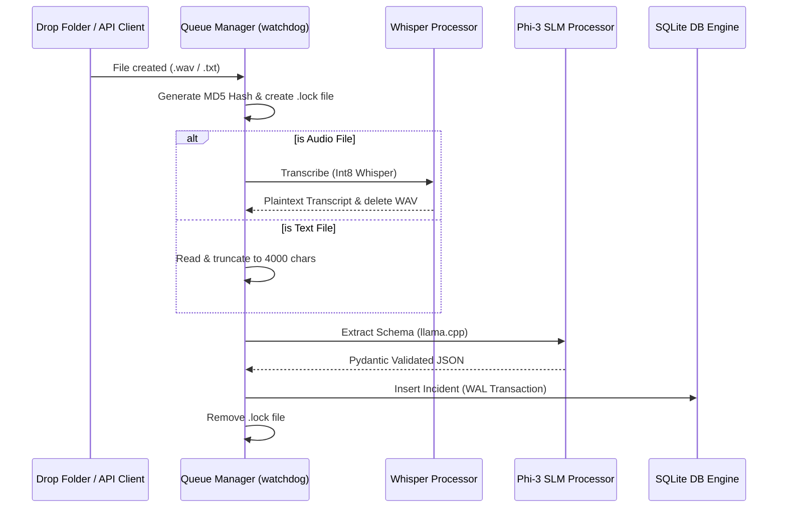

# 🤖 LocalSlate AI Agentic Architecture

LocalSlate utilizes a zero-trust, offline-first pipelined architecture designed to process raw field files (audio/text) and extract structured incident intelligence.

---

## 1. AI & Engine Components

### 🎙️ Whisper Audio Processor
- **Role**: Transcribes raw audio recordings into plain text.
- **Technology**: `faster-whisper` quantized to `int8` for efficient execution on CPU.
- **Boundaries**: Mono, `16kHz` WAV files, `< 25MB`. Runs in 2 threads via `OMP_NUM_THREADS=2`.
- **Mock Fallback**: If the model files (`.models/whisper/model.bin`) are missing, it falls back to a deterministic string matcher to support headless testing and cloud deployments (e.g. Render).

### 🧠 Local SLM Processor
- **Role**: Structures unstructured transcripts or text field notes into a strict JSON schema.
- **Technology**: `Phi-3-mini-4k-instruct-q4` model loaded via `llama-cpp-python`.
- **Boundaries**: Text inputs truncated to `4000` characters. Executed in 2 threads with temperature `0.1`.
- **OOM Protection**: Monitors RAM memory. If RAM utilization exceeds `3.8GB` or system RAM exceeds `95%`, it immediately aborts inference to prevent host system instability.
- **Mock Fallback**: Falls back to regex-based extraction if the model binary (`.models/slm/phi3-mini-4k.gguf`) is missing or if 3 consecutive extraction attempts fail.

### ⚡ Queue Manager
- **Role**: Watches `data/cache/` using `watchdog` to detect new files.
- **Execution Flow**: Moves raw files to `data/queue/` for locked, in-flight processing, updates status telemetry, handles timeouts (120s limit for audio processing), and routes outputs.
- **Failback Archive**: Moves failed items to `data/failed_audio/` and commits a default fallback incident record to the database.

### 💾 SQLite Engine
- **Role**: Relational database storage with a normalized 4-table schema.
- **Concurrency Tuning**: Utilizes **Write-Ahead Logging (WAL)** mode and set `timeout=30.0` connection contexts to prevent database locks, ensuring smooth write operations.

### 🌐 API Layer
- **Role**: FastAPI backend with DI service containers and request validators. Includes `/health`, `/status`, `/incidents`, `/process`, and `/upload` endpoints.

---

## 2. Dynamic Data Flow

---

## 3. Startup & Execution Order

1. **FastAPI Lifespan Startup**:
   - Initialize the SQLite Database (creates tables and indices if not present).
   - Initialize/Start the `QueueManager` watchdog observer.
2. **Models Loading (Deferred/On-Demand)**:
   - Inference models (Whisper, Phi-3 Llama) are lazily loaded on the first file ingestion to save system resources until needed.

---

## 4. Failure Recovery & Resilience

| Scenario | Detection Mechanism | Resolution Action |
| :--- | :--- | :--- |
| **Database Lock** | `sqlite3.OperationalError` | Connection times out after 30 seconds; WAL mode handles concurrent read/write queries. |
| **Audio Processing Timeout** | Background thread monitor | Kills thread after 120 seconds, moves file to `data/failed_audio/`, inserts fallback DB record. |
| **Model Files Missing** | `FileExists` check on path | Logs warnings and enters mock processing mode instantly (Never crashes application). |
| **Inference Format Errors** | Pydantic `ValidationError` | Retries inference up to 3 times with a temperature parameter before falling back to regex parser. |
| **OOM Risk (>3.8GB)** | Host RAM check | Pauses execution, logs error, and saves incident as a failed review item. |
