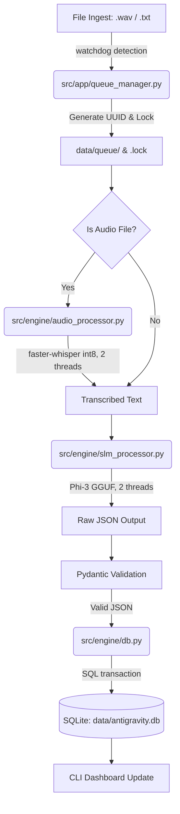

# Antigravity 🌌

[](LICENSE)
[](https://www.python.org/downloads/release/python-3110/)
[](#)
[](#)

Antigravity is a zero-trust, offline-first intelligence processing pipeline designed to extract structured incident reports from raw field notes (audio and text). It executes entirely on local commodity hardware with strict resource boundaries and absolute network isolation.

---

## 📖 Table of Contents
1. [System Specifications & Scope](#-system-specifications--scope)
2. [Processing Pipeline Architecture](#-processing-pipeline-architecture)
3. [Memory & Thread Allocation](#-memory--thread-allocation)
4. [File & Directory Structure](#-file--directory-structure)
5. [Getting Started](#-getting-started)
6. [Development Workflow](#-development-workflow)
7. [System Resilience & Failbacks](#-system-resilience--failbacks)

---

## ⚙️ System Specifications & Scope

The system strictly enforces the following hardware and architectural bounds to prevent host system instability and ensure deterministic local execution:

* **Zero Network Footprint:** Operating under a zero-trust model, all processing is local. No outbound network requests are made.
* **Hardware Ceiling:** Optimized to run within **4GB RAM** and a maximum of **4 CPU threads**.
* **Audio Inputs:** Raw audio files must be mono, `16kHz`, `.wav` format, under `25MB` (~15 minutes of speech).
* **Text Inputs:** Plain UTF-8 text with a hard limit of `4,000 characters` (aligned with Phi-3 context limits).
* **Persistent Storage:** Data is stored in a structured local SQLite database (`data/antigravity.db`).

---

## 🔄 Processing Pipeline Architecture



### Flow Walkthrough
1. **Ingestion:** Files dropped into `data/cache/` are detected by a `watchdog` daemon. It generates an `incident_id` (UUIDv4) and places a `.lock` file in `data/queue/`.
2. **Transcription:** Audio is routed to `faster-whisper` (int8 quantized) to obtain transcripts. The raw audio is pruned immediately after.
3. **Structuring:** The transcribed text is sent to the `Phi-3-mini-4k-instruct` SLM via `llama-cpp-python`. The SLM output is constrained to a specific JSON schema.
4. **Validation & Database Commit:** The JSON schema is validated using Pydantic and committed to a local SQLite database using parameterized queries across 4 normalized tables (`incidents`, `identified_locations`, `identified_personnel`, and `actionable_tasks`).

For more detail, see [spec.md](file:///c:/Users/srees/hackathon_3-1/specs/spec.md), [data-model.md](file:///c:/Users/srees/hackathon_3-1/specs/data-model.md), and [walkthrough.md](file:///c:/Users/srees/hackathon_3-1/specs/walkthrough.md).

---

## 🧠 Memory & Thread Allocation

To protect the host OS from CPU starvation and memory spikes, resources are bounded as follows:

| Resource / Process | Max Memory Allocation | Max Thread Count |
| :--- | :--- | :--- |
| **OS Overhead** | ~500 MB | N/A |
| **faster-whisper (int8)** | ~500 MB | 2 (via `OMP_NUM_THREADS=2`) |
| **Phi-3-mini-4k (Q4_K_M)** | ~2200 MB | 2 (via `n_threads=2`) |
| **Python Dashboard & DB** | ~200 MB | 1 |
| **Total Peak Load** | **~3400 MB** | **Maximum 4 concurrent threads** |

Detailed research and model selection options are located in [research.md](file:///c:/Users/srees/hackathon_3-1/specs/research.md).

---

## 📁 File & Directory Structure

```
hackathon_3/
├── .models/                   # [GIT-IGNORED] Model binary directory
│   ├── whisper/               # faster-whisper configuration & vocab files
│   └── slm/                   # phi3-mini-4k.gguf binary
├── data/                      # [GIT-IGNORED] Databases and filesystems
│   ├── antigravity.db         # SQLite persistent database
│   ├── cache/                 # Raw ingestion folder
│   ├── queue/                 # In-flight queue items
│   └── failed_audio/          # Audio files that timed out or failed validation
├── specs/                     # Project technical specifications
│   ├── data-model.md          # Database schema and input models
│   ├── plan.md                # Environment parity design
│   ├── quickstart.md          # Step-by-step local setup
│   ├── research.md            # Hardware & model selections
│   ├── spec.md                # System boundaries and pipelines
│   ├── tasks.md               # GitLab task matrix
│   └── walkthrough.md         # Trace walkthrough of input files
├── src/                       # Application source code
│   ├── app/                   # App Shell: queue managers, pipeline CLI
│   └── engine/                # Inference Engine: transcription, SLM, DB ORM
└── README.md                  # This file
```

---

## 🚀 Getting Started

Ensure you are connected to the network before completing initial setup.

### 1. Initialize Folders
Run the initialization commands to establish the required git-ignored directory layout:
```bash
mkdir -p .models/whisper .models/slm data/cache data/queue data/failed_audio
```

### 2. Manual Model Deposition
1. **Whisper Engine**: Download `faster-whisper-base-en` files (`model.bin`, `config.json`, `vocabulary.txt`) and place them in `.models/whisper/`.
2. **Phi-3 SLM**: Download `Phi-3-mini-4k-instruct-q4.gguf` and place it at `.models/slm/phi3-mini-4k.gguf`.

### 3. Setup Virtual Environment
Use `uv` for deterministic, fast builds:
```bash
# Install uv dependencies solver
pip install uv

# Initialize and activate Python 3.11 environment
uv venv -p 3.11
# Mac/Linux:
source .venv/bin/activate
# Windows:
.venv\Scripts\activate

# Install exact dependencies
uv pip install -r requirements.txt
```

For full details, review [quickstart.md](file:///c:/Users/srees/hackathon_3-1/specs/quickstart.md) and [plan.md](file:///c:/Users/srees/hackathon_3-1/specs/plan.md).

---

## 🛠️ Development Workflow

The team is split cleanly into two domains:

* **Developer 1 (Engine Core - `src/engine/`):** Responsible for Whisper ingestion, Phi-3 JSON structuring, and SQLite DB execution.
* **Developer 2 (App Shell - `src/app/`):** Responsible for watchdogs, queuing, lockfiles, CLI dashboard UI, and CI/CD pipelines.

Refer to the GitLab Issue board and task list in [tasks.md](file:///c:/Users/srees/hackathon_3-1/specs/tasks.md) for more details.

---

## 🛡️ System Resilience & Failbacks

* **Queue Backup:** Ingestion spikes are handled via disk-backed files inside `data/queue/`.
* **Timeout & Graceful Degradation:** Audio files exceeding 120s of processing time are archived to `data/failed_audio/` and marked in the DB as `PENDING_REVIEW`.
* **OOM Watchdog:** A background worker monitors host RAM. If allocation approaches 3.8GB, the SLM context is pruned, or processing is paused and rescheduled with a backoff delay.

---

## 📄 License

This project is licensed under the **GNU General Public License v2.0 (GPL-2.0)** - see the [LICENSE](file:///c:/Users/srees/hackathon_3-1/LICENSE) file for the full text.
